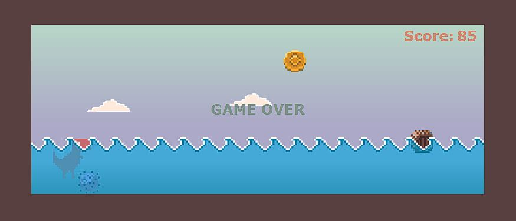

  
   
  <h3><b>Google Chrome - Offline Dino Game</b></h3>

 
<!-- PROJECT DESCRIPTION -->

# 📖 [Google Chrome - Offline Dino Game - Ocean Version] 

Simple html game _(original offline chrome game)_ you can add to your web page for fun 😁.

<!-- LIVE DEMO -->

## 🚀 Live Demo 

- [Dino Game - Live Demo](https://juandiegoguerra.github.io/GoogleChrome-OfflineDinoGame/)

<!-- SUPPORT -->

## ⭐️ Show your support 
> You can support following me.

 - If you like this project you can follow me 🤩! I will be adding more useful material 😁.

